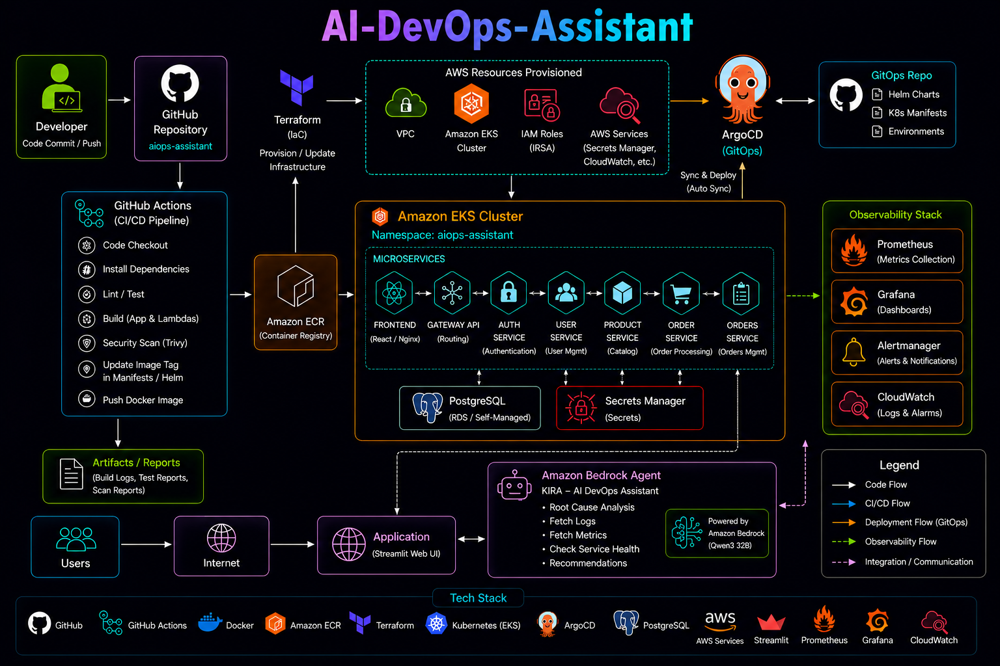
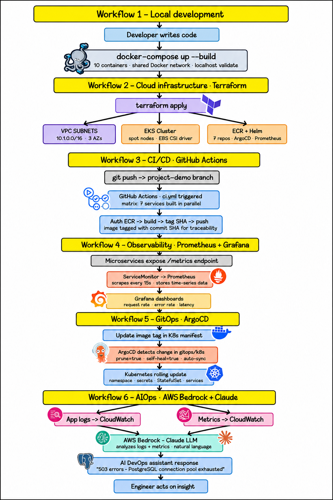

<div align="center">

# 🤖 AI-DevOps-Assistant




</div>

---

# 📖 Project Overview

- AI-DevOps-Assistant is an end-to-end cloud-native DevOps and AIOps platform that demonstrates how modern applications can be built, deployed, monitored and intelligently managed on AWS.

- The project combines Kubernetes, GitOps, Infrastructure as Code, CI/CD automation, observability and Generative AI into a single production-inspired architecture.

- The application follows GitOps principles where Git remains the single source of truth and ArgoCD continuously synchronizes the Kubernetes cluster with the latest repository changes.

- Infrastructure provisioning is completely automated using Terraform while GitHub Actions builds, scans, packages and publishes every microservice automatically.

- The deployed application runs on Amazon EKS and is continuously monitored using Prometheus, Grafana, Alertmanager and Amazon CloudWatch.

---

# 🎯 Project Objectives
- Build a Cloud-Native Microservices Platform
- Implement Infrastructure as Code using Terraform
- Provision an Amazon EKS Cluster
- Deploy containerized workloads on Kubernetes
- Implement GitOps using ArgoCD
- Automate CI/CD using GitHub Actions
- Store Docker images in Amazon ECR
- Secure workloads using IAM, OIDC and IRSA
- Manage secrets using AWS Secrets Manager
- Monitor applications using Prometheus & Grafana
- Centralize logs using Fluent Bit & CloudWatch
- Integrate Amazon Bedrock Agents for AIOps
- Build an AI-powered DevOps Assistant

---

# ✨ Key Features

## ☁ Cloud Infrastructure

- Amazon VPC
- Amazon EKS
- Managed Node Groups
- Amazon ECR
- IAM Roles
- IAM OIDC Provider
- IAM Roles for Service Accounts (IRSA)
- AWS Secrets Manager

---

## 🚀 CI/CD

- GitHub Actions
- Automated Docker Builds
- Security Scanning
- Amazon ECR Push
- Automatic Image Versioning
- Kubernetes Manifest Updates

---

## 🔄 GitOps

- ArgoCD
- Auto Sync
- Self Heal
- Pruning
- Drift Detection
- Desired State Management

---

## ☸ Kubernetes

- Deployments
- Services
- ConfigMaps
- Secrets
- StatefulSets
- Namespaces
- Service Accounts
- Rolling Updates

---

## 📊 Observability

- Prometheus
- Grafana
- Alertmanager
- Fluent Bit
- Amazon CloudWatch
- Metrics Collection
- Log Aggregation
- Dashboard Visualization

---

## 🤖 AI Operations

- Amazon Bedrock Agent
- Lambda Action Groups
- Root Cause Analysis
- Log Investigation
- Metrics Analysis
- Service Health Monitoring
- AI Recommendations

---

# 🧱 Architecture Highlights

```
Developer
     │
     ▼
GitHub Repository
     │
     ▼
GitHub Actions CI Pipeline
     │
     ├────────► Build Docker Images
     ├────────► Security Scan
     ├────────► Push Images to Amazon ECR
     └────────► Update Kubernetes Manifests
                    │
                    ▼
              GitHub Repository
                    │
                    ▼
                 ArgoCD
                    │
                    ▼
            Amazon EKS Cluster
                    │
      ┌─────────────┼─────────────┐
      ▼             ▼             ▼
 PostgreSQL   Microservices   Monitoring
                                   │
                                   ▼
                         Amazon Bedrock Agent
                                   │
                                   ▼
                        AI DevOps Assistant (KIRA)
```


---

# 🛠 Technology Stack

| Layer | Technology |
|---------|------------|
| Frontend | React |
| Backend | FastAPI / Python |
| AI Assistant | Streamlit |
| AI Platform | Amazon Bedrock |
| AI Model | Qwen3 32B |
| AI Actions | AWS Lambda |
| Database | PostgreSQL |
| Containers | Docker |
| Local Development | Docker Compose |
| Container Registry | Amazon ECR |
| Kubernetes | Amazon EKS |
| Infrastructure | Terraform |
| CI | GitHub Actions |
| GitOps | ArgoCD |
| Monitoring | Prometheus |
| Dashboards | Grafana |
| Alerts | Alertmanager |
| Logging | Fluent Bit |
| Log Storage | Amazon CloudWatch |
| Secrets | AWS Secrets Manager |
| Authentication | IAM + OIDC + IRSA |

---

# 📂 Project Structure

```
AI-DevOps-Assistant/

│
├── .github/
│   └── workflows/
│       └── ci.yml
│
├── Architecture/
│   └── architecture.png
│   
│
├── docs/
│
├── gitops/
│   ├── k8s/
│   ├── manifests/
│   ├── kustomization.yaml
│   └── argocd.yaml
│
├── projects/
│
│   ├── boutique-microservices/
│   │
│   ├── Infrastructure/
│   │
│   └── aiops-assistant/
│
├── README.md
│
└── LICENSE
```

---

# 🛠 Tools

# ☸ Amazon EKS Microservices

| Microservice | Responsibility |
|--------------|----------------|
| Frontend | React Web Application |
| Gateway API | Routes requests to backend services |
| Auth Service | Authentication & Authorization |
| User Service | User Management |
| Product Service | Product Catalog |
| Order Service | Order Processing |
| Orders Service | Order Management |

---

# 🗄 Postgres Databases

- User Information
- Product Catalog
- Orders
- Authentication Data
- Application Metadata

---

# 🚀 GitHub Actions Workflow

```
Push Code
      │
      ▼
Checkout Repository
      │
      ▼
Install Dependencies
      │
      ▼
Run Lint/Test
      │
      ▼
Build Docker Images
      │
      ▼
Security Scan
      │
      ▼
Push Images to Amazon ECR
      │
      ▼
Update Kubernetes Manifests
      │
      ▼
Commit Updated Image Tags
```

---

# 📦 Amazon Elastic Container Registry (ECR)

- frontend
- gateway
- auth
- user-service
- product-service
- order-service
- orders

---

# 🔄 GitOps using ArgoCD
```
GitHub
    │
    ▼
ArgoCD
    │
    ▼
Detect Changes
    │
    ▼
Sync Cluster
    │
    ▼
Deploy New Version
```

---

# ☁ Infrastructure Provisioning
- Amazon VPC
- Public Subnets
- Route Tables
- Internet Gateway
- Amazon EKS Cluster
- Managed Node Group
- Amazon ECR Repositories
- IAM Roles
- IAM Policies
- IAM OIDC Provider
- Helm Releases
- ArgoCD
- Monitoring Stack

---

# 🔐 Security 


- IAM Roles
- IAM Policies
- IAM OIDC Provider
- IAM Roles for Service Accounts (IRSA)
- AWS Secrets Manager

---

# 📊 Observability Stack

Prometheus

- Collect Metrics
- Kubernetes Monitoring
- Service Metrics

Grafana

- Dashboards
- Visualization
- Performance Monitoring

Alertmanager

- Alert Rules
- Notifications
- Incident Alerts

Fluent Bit

- Log Collection
- Kubernetes Log Forwarding

CloudWatch

- Centralized Log Storage
- Log Search
- Operational Visibility

---

# 🤖 Amazon Bedrock Integration

- Fetch Logs
- Fetch Metrics
- Check Service Health

Example:

```
Why is my Product Service unhealthy?
```

- Invokes Lambda
- Retrieves metrics
- Collects logs
- Checks service health
- Generates an AI response

---

# 🤖 AI DevOps Assistant (KIRA)

- The AI-DevOps-Assistant extends a traditional DevOps platform by integrating **Amazon Bedrock Agents** to automate operational tasks using Generative AI.

- Instead of manually checking dashboards, logs, and Kubernetes resources, engineers can interact with an AI assistant using natural language.

- The assistant can investigate production issues, analyze metrics, inspect logs, and perform service health checks through AWS Lambda Action Groups.

---

# 🧠 AI Workflow

```
                 User
                  │
                  ▼
         Streamlit Web Interface
                  │
                  ▼
        Amazon Bedrock Agent (KIRA)
                  │
      ┌───────────┼────────────┐
      ▼           ▼            ▼
Fetch Logs   Fetch Metrics   Health Check
      │           │            │
      ▼           ▼            ▼
 AWS Lambda   AWS Lambda   AWS Lambda
      │           │            │
      └───────────┼────────────┘
                  │
                  ▼
     Amazon CloudWatch / Kubernetes
                  │
                  ▼
          AI Generated Response
```

---

# 🚀 Why Amazon Bedrock?

- Large Language Models
- AWS Lambda
- CloudWatch Logs
- Kubernetes Monitoring
- Natural Language Interaction


---

# ⚙ AI Components

## Amazon Bedrock

- Bedrock Agent
- Foundation Model
- Prompt Orchestration
- Agent Instructions

---

## AWS Lambda

### Fetch Logs


- Reading application logs
- Returning recent log entries
- Assisting log investigations

---

### Fetch Metrics

- CPU Usage
- Memory Usage
- Request Count
- Response Time
- Kubernetes Metrics

---

### Fetch Health

- Pod Status
- Deployment Status
- Service Health
- Cluster Health
- Application Availability

---

# 🖥 Streamlit Interface


- AI Chat Interface
- Root Cause Analysis
- Metrics Inspection
- Log Analysis
- Health Checks
- Natural Language Queries
---

# 🔄 Complete End-to-End Workflow

<div align="center">



</div>


---
<div align="center">

# 👨‍💻 Author

## **Nihal N**

**DevOps • Cloud • Kubernetes**

[](https://www.linkedin.com/in/nihal-n-cse/)
---


## If you found this Project useful, consider giving it a ⭐!

</div>